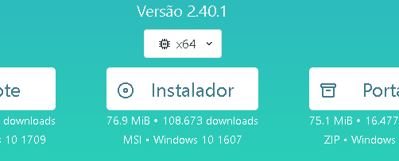

# Projeto com readme
um projeto de teste com um arquivo README 😊



##Tecnologias utilizadas
- HTML 
- CSS
- JS

##  Como utilizar

Clone para o projeto
```
Git clone
```
Acesse a pasta do projeto
```
Cd repositório-com-readme
```

## Coisas que eu parendi com esse projeto.

- Gerar um readme informativo e claro.

- Criar repositórios

- Sites git hub

- Iniciar a trajetória no git